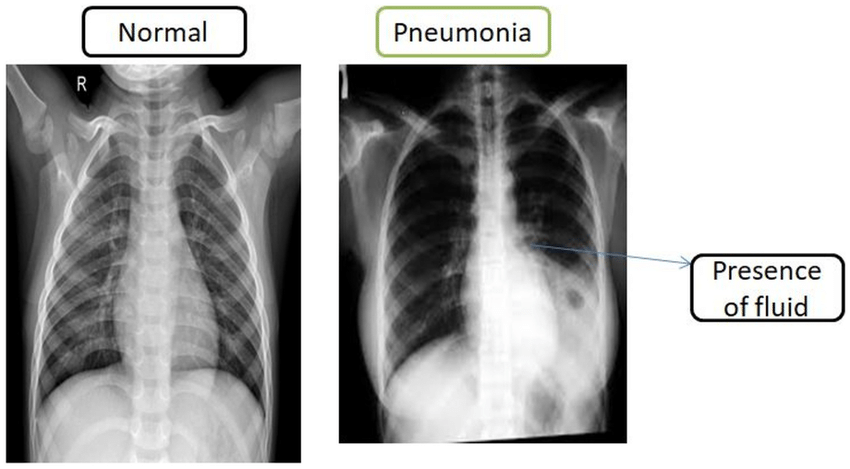

# 🌟 Chest X-Ray Disease Detection using CNN 🩺

This project focuses on utilizing **Convolutional Neural Networks (CNN)** for the **detection of Pneumonia** from chest X-ray images. The goal is to assist in faster and more accurate diagnoses, contributing to better medical decision-making.



## 🚀 Features

✨ **Data Preprocessing**: Efficient cleaning and preparation of X-ray images.  
📊 **Model Training**: CNN-based model to classify chest X-rays.  
📈 **Evaluation**: Performance metrics like accuracy, loss, and confusion matrix.  
📸 **Visualization**: Easy visualization of X-rays and model predictions.

## 🛠️ Installation

1. **Clone the repository**:
    ```bash
    git clone https://github.com/Adi3042/Chest-X-Ray-Disease_Detection_using_CNN.git
    ```
2. **Navigate to the project directory**:
    ```bash
    cd Chest-X-Ray-Disease_Detection_using_CNN
    ```
3. **Install dependencies**:
    ```bash
    pip install -r requirements.txt
    ```
4. **Run app.py**:
    ```bash
    python app.py
    ```
5. **Visit at Given link**:
    ```bash
    http://127.0.0.1:5000/
    ```

## 🧑‍💻 Usage

1. **Download the dataset** from [Kaggle](https://www.kaggle.com/datasets/paultimothymooney/chest-xray-pneumonia).
2. **Prepare the dataset**:
   - Extract the dataset into the `chest_xray` folder.
   - Merge all images from `train`, `test`, and `val` folders:
     - Move all **NORMAL** images into a single `NORMAL/` folder.
     - Move all **PNEUMONIA** images into a single `PNEUMONIA/` folder.
   - Ensure your structure looks like this:
     ```
      Chest-X-Ray-Disease_Detection_using_CNN/
      ├── data/
      │   ├── NORMAL/
      │   ├── PNEUMONIA/
      ├── saved_models/
      │   ├── Chest_Disease_Classifier_Model.h5
      │   ├── Chest_Disease_Classifier_Model.keras
      │   ├── Chest_Disease_Classifier_Model.tflite
      ├── src/
      │   ├── exception.py
      │   ├── logger.py
      │   ├── utils.py
      ├── static/
      │   ├── javascript/
      │   │   ├── index.js
      │   │   ├── contactUs.js
      │   ├── css/
      │   │   ├── index.css
      │   │   ├── contactUs.css
      │   ├── assets/
      │   │   ├── chest.png
      │   │   ├── favicon.png
      │   │   ├── logo1.png
      ├── templates/
      │   ├── index.html
      │   ├── contactUs.html
      ├── app.py
      ├── Chest_X_Ray.ipynb
      ├── requirements.txt
      ├── LICENSE
      ├── .gitignore
     ```

## 📜 License

This project is licensed under the **MIT License**. See the [LICENSE](LICENSE) file for more details.